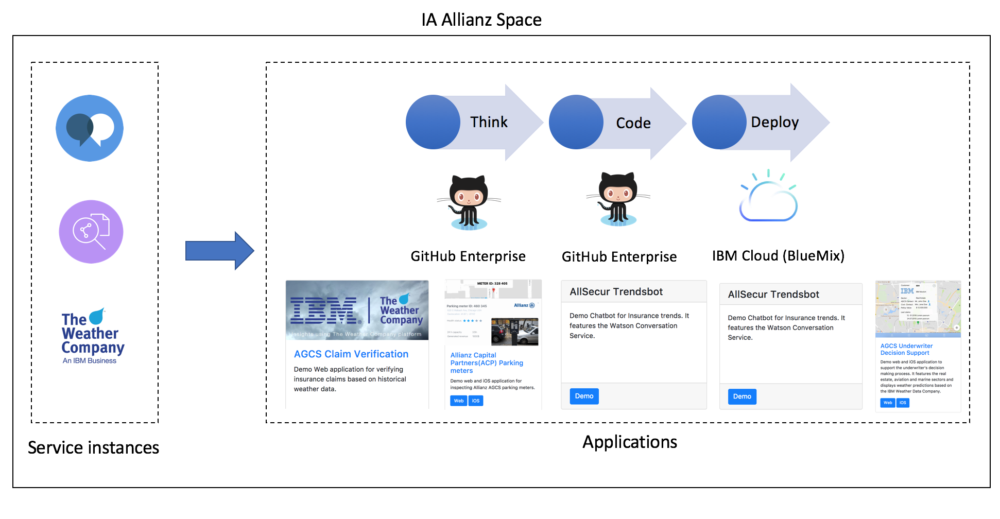

# Overview
The following sections give an overview of the [IA --](https://iaallianz.mybluemix.net/) space.

### Objective
The scope of the IA -- space is to foster the creation of various demo applications based on IBM Cloud services and infrastructure in order to portray relevant insurance business cases. By doing this, we aim to show the capability of IBM services as well as their cognitive intelligence in analysing data and processes. 

### Current Applications
* [Claim Verifications](https://claimverification.mybluemix.net/)
* [Decision Support](http://agcs-decision.mybluemix.net/) - (iOS Version available) 
* [Parking Meters](http://agcs-parking-meter.mybluemix.net/) - (iOS Version available) 
* [Trends ChatBot](http://allsecchatbot.mybluemix.net/)
* [Tierkrankenversicherung ChatBot](http://agcs-tierkranken.mybluemix.net/)

**Facts:** The demo space was created and developed using an internal IBM Account. All cloud services run on a lite or standard plan and given their low usage, have zero costs. The service with the highest usability is the SDK for Node.js. Some services are instantiated and have been used in the past but not all of them are actively used in the current demos. The space includes some other web applications which are deactivated in order to maintain low service usage. 

### Cloud Foundry Services and Infrastructure for IA -- Space
* Continuous Delivery
* Availability Monitoring
* Conversation
* Weather Company Data
* Speech-To-Text/Text-To-Speech
* SDK for Node.js
* ClearDB

### IA -- Space Overview

